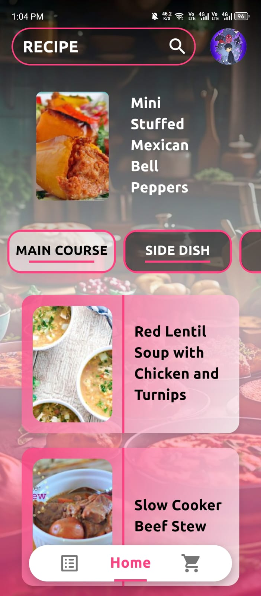
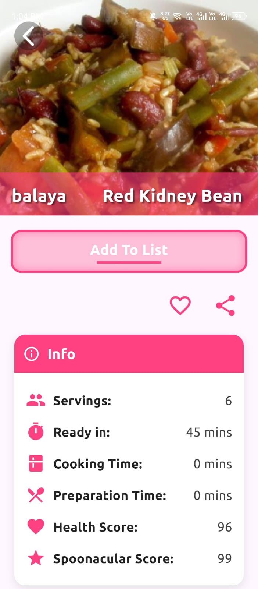
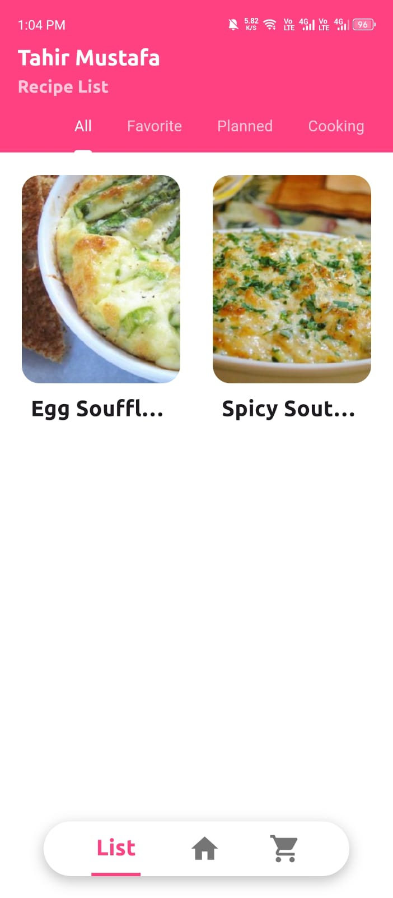

# 🍳 Moreat Recipe Book

A beautiful and feature-rich Flutter recipe application that helps users discover, save, and organize their favorite recipes. Built with Firebase integration for seamless authentication and data management.


## ✨ Features

### 🔐 Authentication
- **Firebase Authentication** - Secure user login and registration
- **Google Sign-In** - Quick authentication with Google accounts
- **Password Recovery** - Forgot password functionality

### 📖 Recipe Management
- **Recipe Search** - Find recipes using powerful search functionality
- **Category Filtering** - Browse recipes by categories
- **Recipe Details** - View comprehensive recipe information including:
  - Ingredients list
  - Step-by-step instructions
  - Nutritional information
- **Favorites** - Save your favorite recipes for quick access
- **Share Recipes** - Share recipes with friends and family

### 🛒 Smart Features
- **Shopping List** - Create and manage shopping lists from recipe ingredients
- **BMI Calculator** - Track your health with built-in BMI calculator
- **Custom Lists** - Organize recipes into custom lists

### 🎨 User Experience
- **Intuitive UI** - Clean and modern interface
- **Recipe Cards** - Beautiful recipe presentation
- **Image Sliders** - Browse recipe images seamlessly
- **Shimmer Loading** - Smooth loading animations
- **Bottom Navigation** - Easy navigation between sections

## 📱 Screenshots

<div align="center">
  
  
  
</div>

### Features Showcase
- **Recipe Detail**: View complete recipe information including ingredients, cooking time, nutritional scores, and more
- **Recipe Lists**: Organize your recipes with tabs for All, Favorite, Planned, and Cooking
- **Browse & Search**: Discover recipes by category with beautiful card layouts

## 🚀 Getting Started

### Prerequisites

Before you begin, ensure you have the following installed:
- [Flutter SDK](https://flutter.dev/docs/get-started/install) (v3.5.2 or higher)
- [Dart SDK](https://dart.dev/get-dart) (v3.5.2 or higher)
- Android Studio / Xcode (for mobile development)
- Firebase account

### Installation

1. **Clone the repository**
   ```bash
   git clone https://github.com/TahirMustafa-NO-ONE/recipe-app.git
   cd recipe-app/moreat_recipe_book-main
   ```

2. **Install dependencies**
   ```bash
   flutter pub get
   ```

3. **Set up API Keys (Required)**

   This project uses `--dart-define` to keep secrets out of source code.

   ```bash
   # Copy the dart-define template
   cp dart_defines/local.env.example dart_defines/local.env
   ```

   Then open `dart_defines/local.env` and fill in your real values:
   ```
   SPOONACULAR_API_KEY=your_actual_key_here
   ```

   Get a free Spoonacular API key at: https://spoonacular.com/food-api

4. **Firebase Setup**

   - Create a new Firebase project at [Firebase Console](https://console.firebase.google.com/)
   - Add Android and iOS apps to your Firebase project
   - Download `google-services.json` (Android) and `GoogleService-Info.plist` (iOS)
   - Place the files in their respective directories:
     - Android: `android/app/google-services.json`
     - iOS: `ios/Runner/GoogleService-Info.plist`
   - ⚠️ Both files are in `.gitignore` — never commit them!
   - Enable Authentication methods in Firebase Console (Email/Password, Google)
   - Set up Firestore Database

5. **Run the app**
   ```bash
   # Development — loads secrets from dart_defines/local.env
   flutter run --dart-define-from-file=dart_defines/local.env

   # Or supply the key inline
   flutter run --dart-define=SPOONACULAR_API_KEY=your_key_here
   ```

6. **Build for release**
   ```bash
   flutter build apk --dart-define-from-file=dart_defines/local.env
   flutter build ipa --dart-define-from-file=dart_defines/local.env
   ```


## 🏗️ Project Structure

```
lib/
├── main.dart                    # App entry point
├── API_key.dart                # API configuration
├── modules/                     # Reusable UI components
│   ├── RecipeCard.dart         # Recipe card widget
│   ├── RecipeSlider.dart       # Image slider widget
│   ├── CategoryButton.dart     # Category button widget
│   ├── add_to_list_btn.dart    # Add to list button
│   ├── filter_bottom_sheet.dart # Filter options
│   └── ...
├── Screens/                     # App screens
│   ├── start.dart              # Welcome screen
│   ├── login.dart              # Login screen
│   ├── register.dart           # Registration screen
│   ├── home1.dart              # Home screen
│   ├── searchScreen.dart       # Search screen
│   ├── arecipe.dart            # Recipe detail screen
│   ├── list.dart               # User lists screen
│   ├── shoppingList.dart       # Shopping list screen
│   ├── bmi.dart                # BMI calculator
│   ├── settingPage.dart        # Settings screen
│   └── ...
└── services/                    # Backend services
    ├── authent.dart            # Authentication service
    ├── DBmethod.dart           # Database methods
    ├── favorite_firestore_service.dart
    ├── search_api_service.dart
    ├── recipe_detail_service.dart
    ├── filter_api_service.dart
    └── user_state.dart         # User state management
```

## 📦 Dependencies

### Core Dependencies
- **firebase_core** (^3.7.0) - Firebase core functionality
- **firebase_auth** (^5.3.2) - User authentication
- **cloud_firestore** (^5.5.1) - Cloud database
- **google_sign_in** (^6.2.2) - Google authentication
- **provider** (^6.1.2) - State management
- **http** (^1.2.2) - API calls

### UI & UX
- **font_awesome_flutter** (^10.4.0) - Icon library
- **shimmer** (^3.0.0) - Loading animations
- **marquee** (^2.3.0) - Scrolling text
- **share_plus** (^10.1.3) - Social sharing

### Storage
- **shared_preferences** (^2.0.11) - Local data persistence

## 🔧 Configuration

### Custom Fonts
The app uses three custom font families:
- **Ubuntu** - Primary UI font
- **Roboto** - Secondary font
- **Lora** - Decorative font

### App Icon
Configured using `flutter_launcher_icons` package. Update `flutter_launcher_icons.yaml` to customize.

## 🤝 Contributing

Contributions are welcome! Please feel free to submit a Pull Request.

1. Fork the project
2. Create your feature branch (`git checkout -b feature/AmazingFeature`)
3. Commit your changes (`git commit -m 'Add some AmazingFeature'`)
4. Push to the branch (`git push origin feature/AmazingFeature`)
5. Open a Pull Request

## 📝 License

This project is licensed under the MIT License - see the LICENSE file for details.

## 👨‍💻 Author

**Tahir Mustafa**

- GitHub: [@TahirMustafa-NO-ONE](https://github.com/TahirMustafa-NO-ONE)

## 🙏 Acknowledgments

- Flutter team for the amazing framework
- Firebase for backend services
- Recipe API providers
- All contributors and supporters

## 📞 Support

For support, email or create an issue in the repository.

---

<p align="center">Made with ❤️ using Flutter</p>
